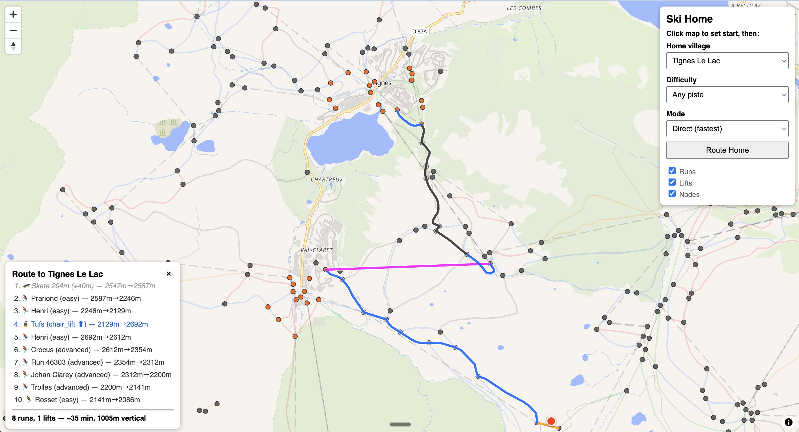

# Ski Home Map

Interactive map for routing skiers home in the Tignes / Val d'Isere linked resort. Click anywhere on the mountain, pick your village, and see the route.

Powered by the [Ski Home API](https://github.com/caldvs/ski-home-api). Built with [MapLibre GL JS](https://maplibre.org) and [OpenFreeMap](https://openfreemap.org) vector tiles.

## Usage

Open `index.html` in a browser, or visit the [live demo](https://caldvs.github.io/ski-home-map).

1. Click the map to set your position
2. Select your home village and difficulty preference
3. Click **Route Home**

## How it works

The map fetches the full routing graph from the API on load to draw runs and lifts. When you request a route, it calls `GET /route?geometry=true` and draws the result on the map with interactive leg highlighting.

No data is bundled in the page — everything comes from the [Ski Home API](https://ski-home-api.onrender.com).

## Data sources

Ski and lift geometry is sourced from [OpenSkiMap](https://openskimap.org) via the [OpenSkiData](https://openskidata.org) project, which is derived from [OpenStreetMap](https://www.openstreetmap.org) data.

- **OpenStreetMap** — [Open Data Commons Open Database License (ODbL)](https://opendatacommons.org/licenses/odbl/)
- **OpenSkiData** — [Open Database License (ODbL)](https://opendatacommons.org/licenses/odbl/)
