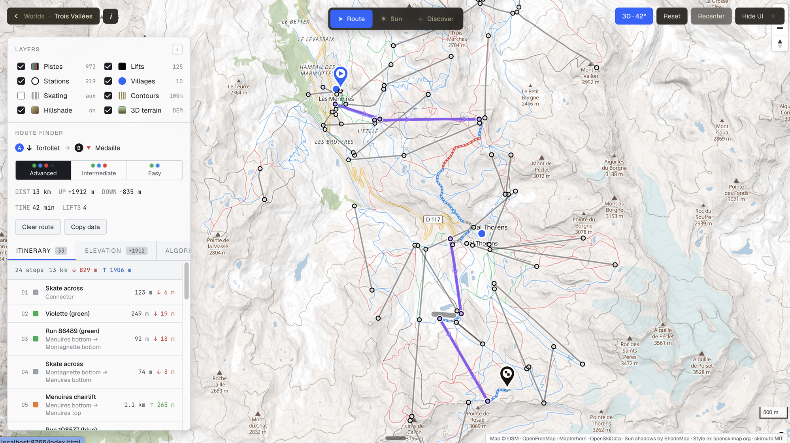
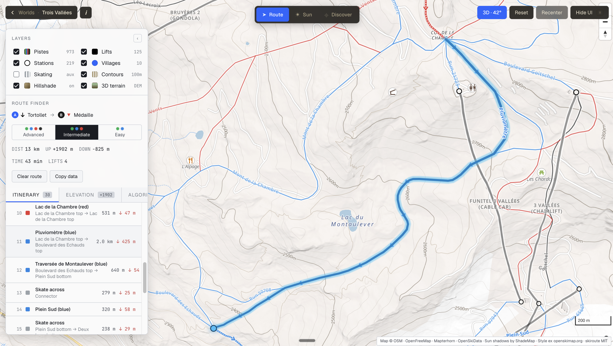
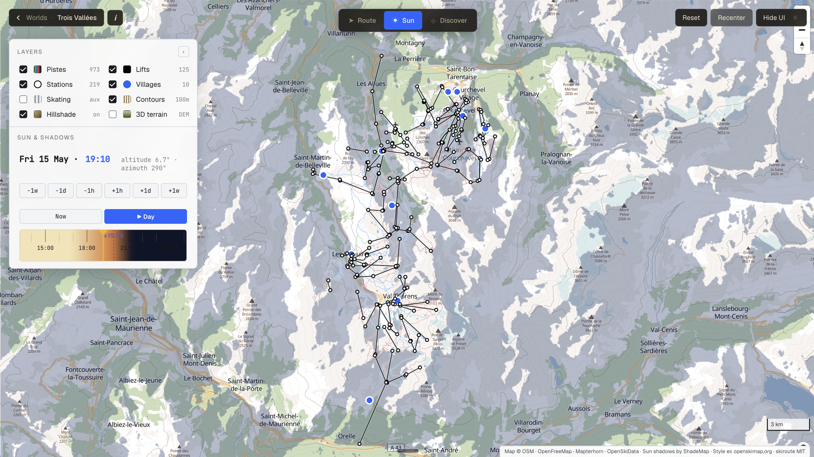

# ski-home-map

Interactive 3D web map for ski routing across French Alpine resorts.

A dashboard for picking which "world" to explore, then a MapLibre GL map
where you drop two pins, get a route, watch the algorithm explore, and
see sun shadows for any time of day. Built on
[skiroute](https://github.com/caldvs/skiroute), powered by
[OpenSkiData](https://openskidata.org/).

**Live**: [caldvs.github.io/ski-home-map](https://caldvs.github.io/ski-home-map/)

### Route mode

Drop pin A and pin B on the map; Dijkstra finds the route under the
selected difficulty filter (Advanced / Intermediate / Easy). Itinerary
panel shows each leg, total distance, vertical ascent / descent, time,
and lift count. Drag either pin to reroute live.



Zoom in for leg-by-leg detail; click a leg in the panel to flash that
segment on the map.



### Sun mode

Drag the time scrubber across the day to watch sun-cast shadows move
over the resort. Useful for working out which slopes are in shade at
which time, e.g. when planning a morning warm-up on the sunny side.



## Worlds available

Sixteen contiguous Savoie ski areas, each a standalone routable graph
in `data/`.

| Region | Resorts |
|---|---|
| Tarentaise | Tignes / Val d'Isère · Trois Vallées · Les Arcs · La Plagne · La Rosière · Sainte-Foy Tarentaise |
| Vanoise west | Valmorel · Pralognan-la-Vanoise |
| Beaufortain | Espace Diamant · Arêches-Beaufort |
| Maurienne | Val Cenis · Bonneval-sur-Arc · Aussois · La Norma · Valfréjus · Galibier-Thabor (Valloire/Valmeinier) |

Earlier versions of this site included two stitched mega-worlds — Tignes
plus Trois Vallées (via two synthetic cable cars over the Vanoise) and
a 16-resort Savoie mega-network. They were removed because the synthetic
connectors didn't produce realistic routes: queries either ignored the
cable cars entirely or sent skiers on absurd continent-spanning rides.
The stitching code is preserved in `skiroute.stitch` for future
experiments with a better connector cost model.

## How it works

- **Static site.** Plain HTML + CSS + ES modules. No build step.
- **Graph data.** Built ahead of time by `skiroute` from the
  [OpenSkiData](https://openskidata.org/) GeoPackage and committed to
  `data/`. See `scripts/build_data.py`.
- **Routing in the browser.** JS Dijkstra / A* / Bidirectional Dijkstra
  run on the loaded graph. ~200 ms per query on the largest world.
- **3D terrain.** [Mapterhorn](https://mapterhorn.com/) DEM tiles via
  MapLibre. Contour lines generated on the fly by
  [maplibre-contour](https://github.com/onthegomap/maplibre-contour).
- **Sun shadows.** [ShadeMap](https://shademap.app/) plugin — free
  educational tier covers localhost / file://. The first visit prompts
  for your API key, which is stored in `localStorage` only.

## System overview

This map and the [skiroute](https://github.com/caldvs/skiroute) library
share a routing graph as their data contract. The map does its own
Dijkstra in the browser on the pre-built JSON graph — it does NOT call
out to any routing API at runtime.

```
                       ┌────────────────────────────────┐
                       │  OpenSkiData GeoPackage (.gpkg)│
                       │  ~500 MB · every resort in the │
                       │  world · ODbL                  │
                       └──────────────┬─────────────────┘
                                      │
                                      │  build-time only:
                                      │  skiroute.build_graph(
                                      │     gpkg, ResortFilter,
                                      │     destinations, overrides_path)
                                      ▼
                       ┌────────────────────────────────┐
                       │  skiroute  (Python library)    │
                       │  ├─ builder    gap-bridging,   │
                       │  │             village tagging │
                       │  ├─ overrides  JSON-driven     │
                       │  │             patches (add/   │
                       │  │             remove/rename/  │
                       │  │             re-type edges)  │
                       │  └─ algorithms                 │
                       │      Dijkstra · A* · Bidir ·   │
                       │      Contraction Hierarchies   │
                       └──────────────┬─────────────────┘
                                      │
                                      │  tignes.json, espace-diamant.json,
                                      │  les-arcs.json, … (per-resort
                                      │  routable graphs)
                                      ▼
                       ┌────────────────────────────────┐
                       │   data/  (committed JSON)      │
                       │   nodes + edges + villages     │
                       └──────────────┬─────────────────┘
                                      │
                                      │  fetched at page load,
                                      │  cached in browser
                                      ▼
                       ┌────────────────────────────────┐
                       │   ski-home-map  (this repo)    │
                       │                                │
                       │   Static JS on GitHub Pages —  │
                       │   no server, no API calls:     │
                       │   ├─ dashboard ("pick a world")│
                       │   ├─ 3D MapLibre map           │
                       │   ├─ browser-side Dijkstra /   │
                       │   │     A* / Bidirectional     │
                       │   ├─ Sun + ShadeMap shadows    │
                       │   └─ Discover mode (inspect    │
                       │       nodes / test routes)     │
                       └────────────────────────────────┘
```

Routing happens entirely client-side: when you load `?world=tignes`
the browser fetches `data/tignes.json` once, then runs Dijkstra against
the in-memory graph for every pin pair. No HTTP round-trips for
routing.

A separate Python FastAPI service ([ski-home-api](https://github.com/caldvs/ski-home-api))
also exists — it's an *independent consumer* of the same graph (loads
the same JSON, exposes `/route`, `/villages`, `/status` over HTTP), but
this map does not depend on it. The two run side-by-side as different
ways to query the same data.

## Sun mode requires a free ShadeMap key

The shadow renderer is [ShadeMap](https://shademap.app/), which
requires a free educational-tier key. On first use the Sun panel
shows an inline prompt — paste your key once and it's saved per-origin
in `localStorage`. Developers can short-circuit the prompt by dropping
a `js/config.local.js` (gitignored) exporting `SHADEMAP_API_KEY = "…"`.

## Use it locally

Just open `index.html`. No build, no dev server.

```bash
git clone https://github.com/caldvs/ski-home-map
cd ski-home-map
open index.html
```

(Or serve via any static server: `python3 -m http.server` then visit
[http://localhost:8000](http://localhost:8000).)

## Rebuild the data

When the OpenSkiData GeoPackage updates and you want fresh graphs:

```bash
pip install skiroute
SKIROUTE_GPKG=/path/to/openskidata.gpkg python3 scripts/build_data.py
git commit data/ -m "Update graphs"
```

## Layout

```
ski-home-map/
├── index.html              dashboard ("pick a world")
├── map.html                map view (?world=tignes)
├── css/
│   ├── style.css           dashboard styles
│   └── map.css             map view styles
├── js/
│   ├── dashboard.js        world tile rendering
│   ├── worlds.js           world preset definitions
│   ├── app.js              map page entry point
│   ├── graph.js            load + reshape skiroute JSON
│   ├── render.js           MapLibre setup + layers
│   ├── routing.js          Dijkstra / A* / Bidirectional
│   ├── sun.js              ShadeMap integration + time controls
│   └── ui.js               panels, pins, algorithm animation, perf
├── data/
│   └── tignes.json         pre-built routing graph
└── scripts/
    └── build_data.py       regenerate data/ from OpenSkiData GPKG
```

## Data sources

| Layer | Source | License |
|---|---|---|
| Base vector tiles | [OpenFreeMap](https://openfreemap.org/) | OpenStreetMap data via [OpenMapTiles](https://openmaptiles.org/) schema |
| Map data | [OpenStreetMap](https://www.openstreetmap.org/copyright) | ODbL |
| Terrain DEM | [Mapterhorn](https://mapterhorn.com/attribution/) | Per their attribution |
| Pistes & lifts | [OpenSkiData](https://openskidata.org/) | ODbL |
| Sun shadow rendering | [ShadeMap](https://shademap.app/) | Free educational tier |
| Routing library | [skiroute](https://github.com/caldvs/skiroute) | MIT |

## License

MIT. See [LICENSE](https://github.com/caldvs/ski-home-map/blob/main/LICENSE).
